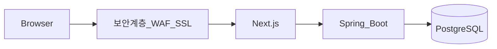

# 프롤로그 — 결심과 현실 이해

## 이 트랙에서 다루는 것

Claude AI를 보조로 삼아 **소규모 웹 서비스**를 설계·구현·배포하는 흐름을 다룬다. 미니 프로젝트를 **AWS 환경**에 올리는 것까지를 범위로 한다. AI에게 맡기는 부분과 개발자가 직접 확인해야 할 **최소한의 IT 개념**을 구분해 두는 것을 전제로 한다.

- **개발 환경(요약):** Claude Desktop·Claude Code, Next.js는 **Visual Studio Code**, Spring Boot는 **IntelliJ Community**와 JDK, **PostgreSQL**, 형상 관리는 **Git**(예: SourceTree, Git Bash), AWS 연동 시 **PuTTY·WinSCP** 등. 설치와 용어는 [[development/vibe-coding/02.tools|도구(02)]]에서 정리한다.

## 학습 목표

- 바이브 코딩(AI 도구 중심)으로 **나만의 서비스**를 끝까지 만들어 본다. 코드 작성을 AI에 맡기더라도 **결과물의 책임과 방향**은 학습자가 잡는다.
- 서비스 기획을 바탕으로 **프로토타입을 빠르게** 만드는 방법을 익힌다. 기획은 고정된 문서가 아니라 **현실적인 자기 상태를 인지한 뒤 AI와 맞춰 가는 협의**로 본다. 그 협의에서 나온 **명확한 지시(프롬프트·요구사항)**가 AI 산출물의 품질을 좌우한다.
- **AWS 기반 배포**를 목표에 포함한다.

## 기대와 시간

과정 중에는 **의사결정**, **환경·설정 오류**, **원인 파악**이 끊이지 않는다. 이를 해결하는 데 쓰는 시간이 생각보다 크다는 점을 미리 두는 편이 좋다. 진행이 멈출 때는 “실력 부족”만의 문제가 아니라 **증상·로그·맥락을 줄여 가며 원인을 좁히는 일**이 핵심이 된다.

## 동기와 비용

플랫폼을 활용한 수익 경험, 혹은 주변 흐름에 끌려 **가볍게 시작한 시도**에서 관심이 생긴 경우도 있다. 들어가는 것은 **제한된 비용과 시간**이고, 큰 손실 없이 시도해 볼 수 있는 범위라는 인식이 있다. 그 위에서 **자신만의 서비스를 갖고 싶다**는 쪽으로 방향을 잡는다. 비슷한 생각을 가진 사람에게 이 정리가 도움이 되기를 바란다.

**비용이 드는 대표 항목:** AWS, Claude Code 등(구체적 도구와 절차는 [[development/vibe-coding/02.tools|02]] 참고). 플랫폼 정책·한도 변화가 학습 리듬에 미치는 점은 [[development/ai-industry/claude-usage-limit-policy-analysis|별도 노트]]에서 다룬다.

## 선수 지식과 이 강의의 전제

이 트랙은 “아무것도 모르는 상태”가 아니라, **일정 수준의 개발·인프라 감각**이 있으면 수월하다는 전제에 가깝다.

**있으면 유리한 배경**

- C/C++ 등 **시스템에 가까운 언어** 경험
- **네트워크·IT 인프라**, CS 기초, 정보보안에 대한 **개념 수준의 이해**(세부는 강의·실습에서 보강)

**이번 과정에서 특히 보강·재확인하게 될 부분**

- **Docker·AWS 서비스 운영**은 실무 경험이 없어도 따라가도록 구성되나, 초기에는 낯설 수 있다.
- **SQL**은 예전에 익혔다면 복습이 필요할 수 있다.
- 일반적인 개발 오류는 **스스로 로그와 문서를 따라 해결할 수 있다는 태도**가 있으면 좋다. 동시에 클라우드·컨테이너처럼 **처음 쓰는 스택**에서는 막히는 구간이 생기는 것이 정상이다.

## 목표 아키텍처 한눈에

사용자 요청은 **인터넷 경계의 보안 계층(WAF·SSL 등)**을 지나 프론트(Next.js), API 서버(Spring Boot), DB(PostgreSQL)로 이어지는 형태를 목표로 한다. 보안 범위·WAF 배치·접근 통제의 세부는 [[development/vibe-coding/03.security|보안(03)]]에서 다룬다.

## 사전 개념 체크리스트

서비스 구성을 잡기 전에, 아래 용어를 **대략이라도** 짚고 가면 이후 장이 수월하다.

- **하드웨어·실행:** CPU, RAM, SSD 등 컴퓨터 **스펙**; 프로세스·스레드·동기화; JVM은 WAS가 돌아가는 **런타임 기반**으로 이해
- **데이터:** 관계형 DB, 트랜잭션, 롤백·커밋, 백업; 실무에서는 MySQL·**PostgreSQL** 등이 흔함
- **파일 입출력**
- **프레임워크:** React·**Next.js**·**Spring Boot**; Spring Boot 기반 **API 서버**
- **REST API:** 엔드포인트를 **함수 호출**에 비유해 이해; 응답은 보통 **JSON**
- **네트워크:** 공인·사설 IP, 포트; 웹 서버·WAS가 떠 있는 호스트의 주소 개념
- **웹:** URL, 도메인, DNS, HTTP, SSL·인증서, `localhost`(127.0.0.1)
- **프론트 기초:** HTML(tag, id, class), CSS, JavaScript
- **역할 구분:** 웹 서버(정적·프론트 배포)와 **WAS**(애플리케이션 서버)

## REST·문서화·기술 부채

AI에 구현을 맡기면 속도는 나지만, **이해 없이 쌓인 코드는 기술 부채**가 된다. 프로그래밍이 진행될수록 **최초 설계에서 벗어나는 일**은 흔하다. 초기에 미처 몰랐던 요구가 드러나거나, **구조적 결함**을 고치거나, **새 기능**을 넣다 보면 기존 설계가 받쳐 주지 못하는 지점이 생긴다. 그때마다 **고치고 뜯어고치는 일**이 반복된다.

그래서 AI가 만든 **백엔드 REST API**는 반드시 **별도 문서**로 관리하는 것이 좋다. 변경 이력마다 **원인·대응**이 남도록 프론트·백엔드 각각 문서를 두고, **SQL 스크립트**도 함께 관리하는 습관이 필요하다.

## 다음 문서

- [[development/vibe-coding/02.tools|02. 도구]] — IDE, Git, 서버·DB·AWS 보조 도구, Claude
- [[development/vibe-coding/03.security|03. 보안]] — 범위 정하기, WAF, 인프라 노출, 접근 통제
