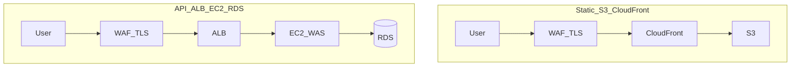

# 보안 — 범위, 노출, 접근 통제

## 왜 초기부터인가

초기에 보안 범위와 노출 면을 정하지 않으면, 이후 **침해 사고·데이터 유출·서비스 중단**으로 이어질 수 있고, 그때 가서 막는 비용은 훨씬 크다. **재작업**, **규제·약관 대응**, **사용자 신뢰 손실**까지 한 번에 감당해야 할 수 있다. “나중에 붙이자”는 선택이 **생산성을 깎고 비용으로 돌아오는** 경우가 많다.

## 정보보호 목표(CIA)와 법·거버넌스

정보보호를 말할 때 흔히 **CIA**로 정리한다.

- **기밀성(Confidentiality):** 허용된 주체만 데이터를 볼 수 있게 한다. 전송·저장 시 **암호화** 등이 대표적 수단이다.
- **무결성(Integrity):** 데이터와 시스템이 **의도하지 않게 바뀌지 않았음**을 보장한다. 해시·서명, 접근 통제, 감사 로그 등이 관련된다.
- **가용성(Availability):** 정당한 사용자가 필요할 때 서비스를 쓸 수 있게 한다. 과도한 공격·설계 실패로 서비스가 멈추지 않도록 하는 것도 보안 범주에 포함된다.

**ISMS-P** 등 국내 정보보호 체계는 **사업 규모·처리하는 정보의 성격**에 따라 검토 대상이 될 수 있다. 이 문서는 법률 자문이 아니며, 실제 의무 여부는 사업 맥락에서 별도 확인이 필요하다.

**OAuth2**는 외부 계정 로그인·API 연동처럼 **인증을 위임**해야 할 때 검토하는 패턴이다. 직접 비밀번호를 저장·검증하는 것보다 역할이 분리되어 운영하기 쉬운 경우가 많다.

## 보안 범위와 개인정보

서비스를 만드는 단계에서 **무엇을 지킬지(목적)** 와 **어디까지가 경계인지(범위)** 를 정한다. 그다음 **수집하는 개인정보**를 미리 정하되, **가능한 한 최소화**한다.

- 대부분의 경우 **이메일, 이름, 닉네임** 정도로 충분한 경우가 많다.
- **전화번호**는 실제 고객센터·본인 확인 등 운영상 필요할 때만 수집을 검토한다.

## 바이브 코딩과 프롬프트

보안을 전제에 둔 설계(노출 면, 인증, 로깅)가 정리되어야 **프롬프트에 넣을 요구사항**도 구체해진다. 반대로, **API 키·비밀번호·세션 토큰·개인정보**를 프롬프트나 채팅 로그에 넣지 않는다. AI 도구와 협업할수록 **비밀이 프롬프트·스크린샷·저장소에 새는 경로**를 의식하는 것이 중요하다.

## 공개 노출과 엣지 보안

프론트엔드와 공개 API는 **인터넷에 노출**되는 것이 일반적이다. **검색 엔진 노출(SEO)** 을 위해 크롤러가 접근할 수 있는 공개 URL이 필요할 수 있으며, 그 경우에도 **악의적 트래픽·취약점 스캔**에 대비한 **엣지 보안**은 별개로 갖춘다.

- **TLS(SSL):** 브라우저·클라이언트와 서버 사이 전송 구간을 암호화한다. **인증서**로 서버 신원을 확인하는 흐름이 함께 온다.
- **WAF(Web Application Firewall):** L7에서 알려진 공격 패턴·비정상 요청을 걸러 낸다. **CloudFront·ALB 앞단** 등 **인터넷과 가까운 위치**에 두는 것이 일반적이며, 공개 서비스에서는 **사실상 필수에 가깝다**고 보는 경우가 많다. 개인 PC 앞단에 오픈소스 WAF를 두는 것도 가능하지만, **정책·패치·모니터링 부담**이 커서 이 트랙에서는 권장하지 않는다.

## 목표 인프라 배치(요약)

사용자 → 보안 계층 → 애플리케이션 → DB라는 **논리 흐름**은 [[development/vibe-coding/01.prologue|01. 프롤로그]]의 다이어그램과 같다. AWS에서는 대표적으로 **정적 프론트**와 **API·DB** 갈래로 나누어 볼 수 있다. 프론트는 **S3 + CloudFront** 외에 **Amplify** 등으로 배포하는 경우도 있으며, **앞단에 WAF·TLS를 두는 원칙**은 동일하다.

## 관리·DB 접근 통제

EC2(WAS)·RDS(DB)는 **관리 목적**으로만 열려 있어야 하며, **공인 IP를 넓게 열어 두면** 무차별 공격·브루트포스에 노출되기 쉽다.

- **IP 허용 목록:** 관리자·배포용 접속은 알려진 IP 대역만 허용하는 방식을 검토한다.
- **키 기반 SSH:** 패스워드만으로 SSH를 열기보다 **키 기반 인증**을 쓰는 편이 안전한 경우가 많다.
- **DB 공개 접속:** RDS 등은 가능하면 **퍼블릭 액세스를 끄고**, 애플리케이션은 **사설망(VPC)** 안에서만 DB에 붙이는 구성을 우선한다. 운영자가 로컬에서 DB에 붙어야 할 때는 **SSH 터널** 등으로 우회하는 방식이 흔하다.
- WAS·DB는 **가능한 한 사설 서브넷**에 두고, 인터넷에서 직접 DB 포트로 들어오지 못하게 한다.

## 시크릿과 환경 변수

[[development/vibe-coding/02.tools|02. 도구]]에서 말한 것처럼, **API 키·DB 비밀번호·JWT 시크릿** 등은 소스와 분리해 관리한다.

- **`.env` 등 비밀 파일은 Git 저장소에 커밋하지 않는다.** `.gitignore`에 포함한다.
- 배포·CI에서는 **환경 변수·시크릿 매니저** 등으로 주입하고, 팀 공유는 **암호화된 채널**이나 권한이 있는 저장소만 사용한다.
- 저장소에 올린 적이 있는 키는 **회수·재발급**을 전제로 한다(히스토리에 남을 수 있음).

## 추가로 짚을 키워드

웹 API와 브라우저 쿠키를 다루면 **CORS·CSRF**를 각각의 역할로 이해할 필요가 있다. 프론트 의존성은 주기적으로 **`npm audit`** 등으로 알려진 취약점을 확인하는 습관이 도움이 된다.

## 다음·이전 문서

- [[development/vibe-coding/02.tools|02. 도구]] — IDE, Git, 배포 보조 도구
- [[development/vibe-coding/01.prologue|01. 프롤로그]] — 트랙 범위·목표 아키텍처 개요
