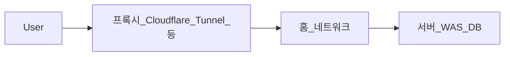

# 서비스 운영 — 호스팅 옵션과 선택

## 이 문서의 위치

[[development/vibe-coding/01.prologue|01. 프롤로그]]는 트랙 범위와 목표 아키텍처, [[development/vibe-coding/02.tools|02. 도구]]는 로컬·협업 도구, [[development/vibe-coding/03.security|03. 보안]]은 노출·WAF·접근 통제를 다룬다. 이 문서는 **서비스를 어디에 두고 어떤 운영 모델로 돌릴지**(홈 PC, 매니지드 PaaS, AWS)의 **장단점·비용 감각·의사결정**만 정리한다. AWS 상의 구체 배치·WAF 위치는 03을 따른다.

## 홈 PC(셀프 호스팅)

집이나 개인 사무실 PC를 서버로 쓰면 **초기 하드웨어 비용만**으로 시작할 수 있어 **가성비**가 좋아 보일 수 있다. 다만 **공인 IP 노출**, **가동 시간**, **보안**을 스스로 설계해야 한다.

- **공인 IP 완화:** **Cloudflare**(Tunnel 등)·리버스 프록시·VPN 조합으로 집 네트워크를 직접 노출하지 않는 패턴이 흔하다. 제품명·절차는 시점에 따라 바뀌므로 공식 문서를 기준으로 한다.
- **가용성:** 전원·하드웨어 장애·ISP 장애 시 서비스가 멈출 수 있어, **24시간 안정적 운영** 기대치는 퍼블릭 클라우드보다 낮게 잡는 편이 현실적이다.

**장점**

- PC 한 대로도 소규모 서비스 검증 가능
- 초기 현금 부담을 낮출 수 있음

**단점**

- CPU·RAM·디스크·전원 등 **하드웨어 여유**가 곧 성능·안정성
- **보안 대응**(침해·패치·로그)을 직접 갖춰야 함
- 물리망·OS·스위치·전원까지 **운영 범위가 넓음**
- 홈/소규모 인프라는 **AI 보조로 맞추기 어려운 예외 케이스**가 많음

엣지·WAF·DB 접근 통제의 원칙은 [[development/vibe-coding/03.security|03. 보안]]과 같다.

## Vercel + Supabase

**프론트·API를 서버리스에 가깝게** 올리고, **DB·인증·스토리지**를 Supabase로 묶는 조합이다. **바이브 코딩으로 빠르게 서비스 형태를 만드는 데** 무난한 경로 중 하나다.

- 간단한 서비스·프로토타입에 적합하고, **자동 확장**으로 트래픽 변동을 일부 흡수한다.
- **별도 WAS 없이** Serverless Functions 형태로 API를 둘 수 있다.
- **DB 스키마·인증·스토리지**를 대시보드와 SDK로 빠르게 붙일 수 있다. **Auth·소셜 로그인·이메일 인증** 등은 플랫폼 쪽 구현을 많이 빌린다.
- Supabase의 DB는 **PostgreSQL 계열**이라, 개념적으로는 [[development/vibe-coding/01.prologue|01]]의 PostgreSQL 전제와도 이어질 수 있으나, **강의 본류 스택(Next + Spring Boot on AWS)** 과는 **배포·런타임이 다르다**.

**비용·구조**

- **대역폭·요금 플랜**이 트래픽 패턴에 민감할 수 있어, **동영상·대용량 다운로드** 등이 많으면 AWS 자체 구성과 **요금 시뮬레이션을 비교**하는 것이 좋다.
- 플랜·가격은 수시로 바뀌므로 「1만 명 기준 Pro로 충분」류의 말은 **참고용 가정**으로만 둔다.

## AWS 기반 운영

[[development/vibe-coding/01.prologue|01. 프롤로그]]는 **AWS에 올리는 미니 프로젝트**를 목표로 한다. 대표적으로 정적·프론트(Amplify, S3+CloudFront 등)와 API·DB(ALB, EC2, RDS 등)를 나누어 운영한다. **구체 흐름·WAF·TLS**는 [[development/vibe-coding/03.security|03. 보안]]의 Mermaid와 설명을 따른다.

**특징**

- **인프라 설정·모니터링·패치·비용 최적화** 책임이 개발자(또는 팀)에게 있다.
- 트래픽 단가는 구조에 따라 **PaaS보다 유리할 수 있으나**, 고정비·예약 인스턴스·스토리지 등을 **직접 관리**해야 한다.
- 아래 달러 수치는 **시점·리전·트래픽에 따라 크게 달라질 수 있는 예시**이며, 단정이 아니다.

## AWS를 택할 때의 의사결정(정리)

원고에 흩어져 있던 이유를 **한 축으로** 정리하면 다음과 같다.

**홈 PC 호스팅 대신 클라우드를 본 경우**

- 네트워크 스위치·전원·물리 서버실 환경·OS 패치까지 **집/사무실 인프라에 묶이고 싶지 않을 때**
- **24시간·외부 공격**까지 포함한 운영을 “집 한 대”에 올리기 부담스러울 때

**Vercel + Supabase와의 비교 축**

- 특정 PaaS의 **기능·요금·제약**에 서비스 전체가 지나치게 **묶이는 것**을 피하고 싶을 때(포터빌리티·세부 통제).
- 사용자 수·기능이 커져 **EC2·RDS·WAF** 등으로 **세분화해 튜닝**할 여지를 남기고 싶을 때

**감수해야 할 것(AWS)**

- **DDoS·악성 트래픽** 대응을 위해 WAF를 쓰면 **탐지 규칙·오탑**을 주기적으로 다뤄야 한다(개요는 03).
- 배포·인프라 변경 시 **장애 리스크**를 운영 프로세스로 관리해야 한다.
- “인프라에 시간을 안 쓴다”기보다, **물리 홈 운영 대신 클라우드 운영**에 시간을 쓰는 선택에 가깝다.

## 비용·규모 체크(예시)

아래는 **참고용 가정**이다. 실제 청구는 리전, 데이터 전송, RDS 스펙, 로그, 백업 등에 따라 달라진다.

| 가정(예시) | 내용 |
|------------|------|
| 월 고정비 감각 | 초안에서 언급된 수준으로, 소규모 EC2+RDS만 둘 때도 **월 수십~백 달러대**를 전제로 두는 경우가 많다고 이해하면 된다. |
| 트래픽 | **영상·대용량 파일**이 중심이면 전송·스토리지 비중이 급증할 수 있다. |
| 인스턴스 예 | `t3a.medium`(vCPU 2, RAM 4GB) 등은 **개발·소규모**에 자주 쓰이는 예시 스펙이다. |
| 사용자 수 | 회원 **약 1,500명 미만**·특정 부하 패턴 같은 **개인 프로젝트 가정**은 시뮬레이션의 출발점일 뿐이다. |

## 옵션 비교 요약

| 구분 | 초기 난이도 | 운영 부담(요지) | 비용 민감도 | 강의 스택(01)과의 관계 |
|------|-------------|-----------------|-------------|-------------------------|
| 홈 PC | 낮음~중간 | 물리·네트워크·보안 직접 | 전기·장비 위주 | 강의와 거리 있음 |
| Vercel + Supabase | 낮음 | 플랫폼에 위임, 플랜·대역폭 이해 필요 | 트래픽·플랜에 민감 | 빠른 대안 경로 |
| AWS | 높음 | 모니터링·보안·비용 최적화 직접 | 유연하나 설계 필요 | **본 트랙과 정합** |

가동률·SLO를 높게 잡을수록 **홈 단일 장비**는 불리하고, **매니지드 클라우드** 쪽이 유리해지는 경향이 있다.

## 관련 문서

- [[development/vibe-coding/01.prologue|01. 프롤로그]] — 범위·목표 아키텍처
- [[development/vibe-coding/02.tools|02. 도구]] — IDE, Git, 원격 작업
- [[development/vibe-coding/03.security|03. 보안]] — WAF, TLS, 접근 통제, 시크릿
- [[development/vibe-coding/05.admin-system|05. 관리자 시스템]] — 운영이 붙은 뒤 관리 기능 요구사항(선택)
